==============================
拙作パッチとツールで爆速ダイヤ制作 in Extended
==============================

2017/12/7, りょくちゃ (`@suitougreentea <https://twitter.com/suitougreentea>`_)

この記事は、`Simutrans Advent Calendar 2017 <https://adventar.org/calendars/2316>`_ 7日目の記事です。

皆さん恐らく初めまして。りょくちゃと申します。1ヶ月ぐらい前にSimutrans界隈にひょっこり出てきた新参者ですが、皆さんこれからどうかよろしくお願いします。少し長くなりますが、よろしければお付き合いください。

自己紹介
-----

初めましてなので、まず私のシムトラ事情を少しだけ書いておきたいと思います。
去年の夏休みにOpenTTDにドハマリしていた時、Simutransも少し触ってみたのですが、アドオンの導入や操作方法などに慣れず、一度手放してしまいました。その後大学で偶然、シムトラをプレイしている某氏に出会い、何かあったときのためにと、シムトラ勢とのコネクションを一人確立したのであります。

結局それ以来彼とは直接シムトラの話をしていなかったように思いますが（なんだか申し訳ない）、時々彼を通じて流れてくる日本勢の活発な活動の様子に心惹かれるわけです。そして今年の夏頃、OpenTTDでは物足りなくなった私は（やはり複層高架が作れたり、トンネルや橋にも信号が置けたり、路線名の設定ができたりするシムトラの自由度の高さは魅力的でした）Simutransに真面目に手を出してみることになりました。

最初はpak64に色々アドオン突っ込んでみたり、pak128.japanで遊んでみたりしていたわけですが、程なくしてよりリアリティを追求したExtended版に興味を持ち始めます。それからpak128.britain-exで現在遊んでいるマップを開始し、今に至ります。

10月頃に、鉄道路線を再編した際の計画マップはこんな感じです。旅客輸送が中心。

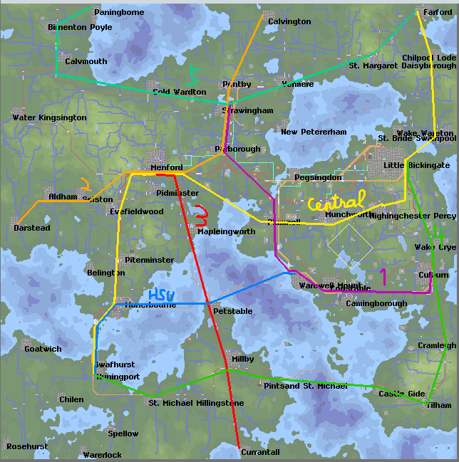

ってか、全然儲からないですよねこのゲーム。OpenTTDのデフォルトが相当ヌルゲーなのがわかります。

さて、11月頃の話です。人間の情動とは本当にわからないもので、突如シムトラモチベがぐんと上昇し始めます。手始めにTwitterで日本のすごそうな人を一方的にフォローし始めます。さっきも書いたように、日本勢は意欲的な人が多いですから、そういった人たちから情報を得られる環境を作ることができれば有益だと思ったのです。それからInternational Forumにも登録し、Extendedのバグを見つけて報告したりといったことも始めます（James氏の対応の速さには毎回驚かされます）。

モチベーションの下がるところは知らず、これからご紹介するツールとパッチ（未完成）を爆速で作りTwitterで紹介したところ、それなりの反響があったようで、界隈の中で多少の知名度を獲得したわけです（本当か？）。

恐らく今後の主な活動分野は、Extendedの本体や外部ツールの開発になると思います。まあまずは、冬のシムトラ学会での発表を予定していますので、参加される方々はどうかよろしくお願いします。

なお、Simutransの他にも色々やってます。興味があれば `Twitter <https://twitter.com/suitougreentea>`_ を覗いてみてください。

さて、ここからが本題です。

Excelでダイヤ組んでた
-------------

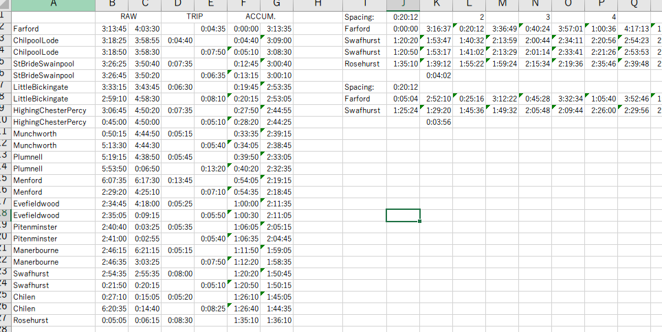

Extendedを始めてから、ダイヤの作成はExcelで行っていました。OuDia等のダイヤ制作ツールも軽く試してみましたが、Extendedではデフォルトで1ヶ月が6時間24分と中途半端です。また、パターンダイヤに特化しているかというとそうでもなく、やはりExtendedのダイヤを組むためには使いづらいものでした。

面倒なのでツール書いた
-----------

いくつか単純なダイヤを組んで、Excelによる製作工程も大分慣れてきたとはいえ、どうしても面倒ですし、やはりダイヤグラムを視覚的に確認しながら試行錯誤したくなります。先に書いたように、一般的なダイヤ作成ツールでは何かとExtendedの仕様にマッチしません。

そこで、Extendedのダイヤを組むことだけに特化したツールを作ろうと思い立ったのです。それを現在 `SimuDia <https://github.com/suitougreentea/SimuDia>`_ として公開しています。

比較的簡単な構文のテキストファイルを読み込むと、ダイヤグラムが表示されます。上書き保存されると自動で更新されるようになっているので、こんな感じで横に並べて作業すると良いと思います。

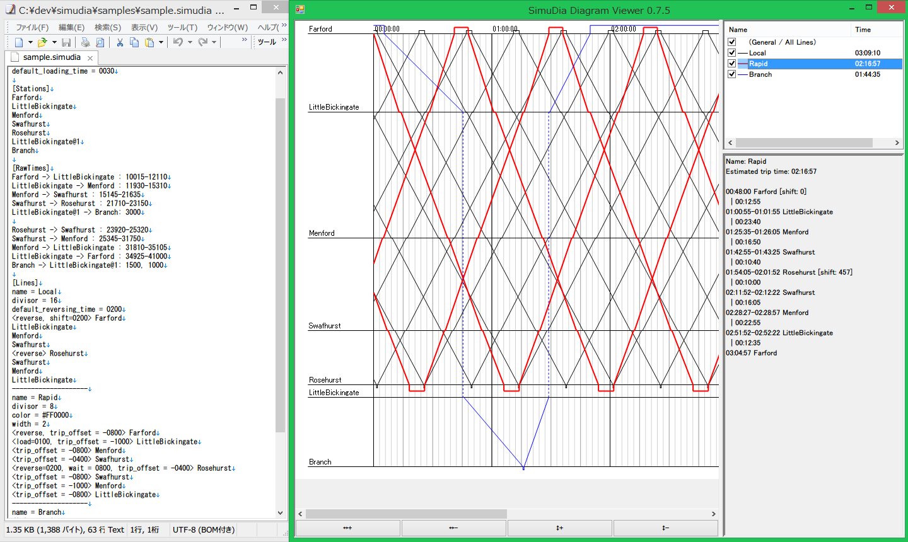

最初は軽くスクリプト言語で書くつもりだったのですが、手軽にウィンドウが表示できて、図形描画がしやすくかつある程度慣れた言語が良いと判断し、C#.netを使うことになりました。Windows固有の機能を使わないように配慮することで、他プラットフォームではMonoを通して動作するようになっています。（Windows.Formsがそのまま動くの、すごい！）

更に面倒なのでパッチ書いた
-------------

制作したダイヤがグラフィカルに確認できるようになりました。調整作業が格段と楽になったとはいえ、結局ダイヤ制作で一番面倒なのは各駅間の時間計測です。ツールを作る前から、この作業は自動化できたらなあと常々思っていました。当時ちょうど、街が成長しないバグの原因を突き止めるために（報告の結果、現在は修正されています）、開発環境をセットアップしていたため、良い機会だと思い本体改造にも着手してみることにしました。

大規模なソフトでは、やはりどういう設計になっているのかを学ぶのが大変です。まして不慣れなC++です。しかも何かとレガシーです。色々と試行錯誤しながら、なんとか形にした第1作の動作動画が `コレ <https://twitter.com/suitougreentea/status/931473543933526016>`_ 。
動画ではスタート/ストップのボタンで計測していますが、現在は過去3回分の時間データを常に蓄積し、それを表示するという実装に変更しました。更に、路線ごとだけではなく、車両ごとの履歴を見れるようになりました。現状はこんな感じ。

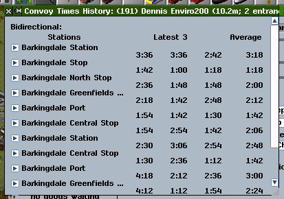

現在、 `line-time-measurementブランチ <https://github.com/suitougreentea/simutrans-extended/tree/line-time-measurement>`_ で作業を進めており、フォーラムにもこの機能に関するスレッドを作りました。本体に組み込んでもらうにはまだまだ改良が必要そうですが、人柱さんはリポジトリをクローンしてコンパイルさせてみると良いと思います。現時点で十分便利だと自負しています。

組み合わせて爆速
--------

将来的にパッチが本体に組み込まれれば、ダイヤの制作を従来に比べて爆速で行うことが出来るようになります。具体的なケースとして、私のプレイしているマップでのダイヤ改正を行ってみることにします。

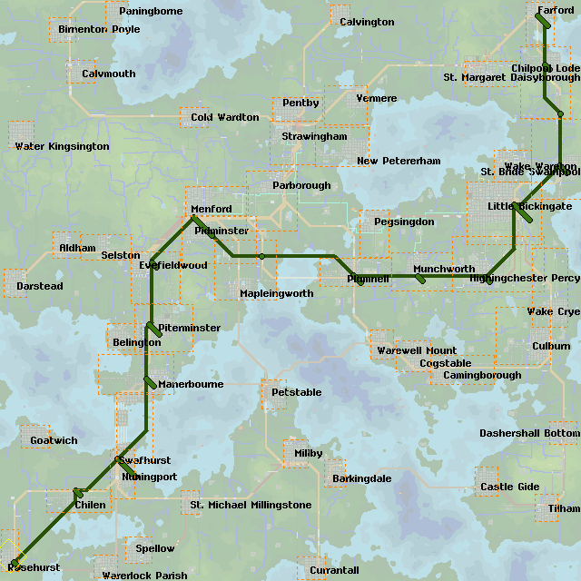

路線名はModernNetwork Central Line。その名の通り、旅客輸送の中心を担う重要な幹線です。全線電化複線区間となっています。

現在は全ての列車が各駅に停車していますが、停車駅を減らした快速の種別を加えましょう。運行比は1:1です。

まず、各駅停車の駅間走行時間を計測します。滞りなく運転していれば、また路線を変更したばかりでなければ、このボタンを押すだけです:

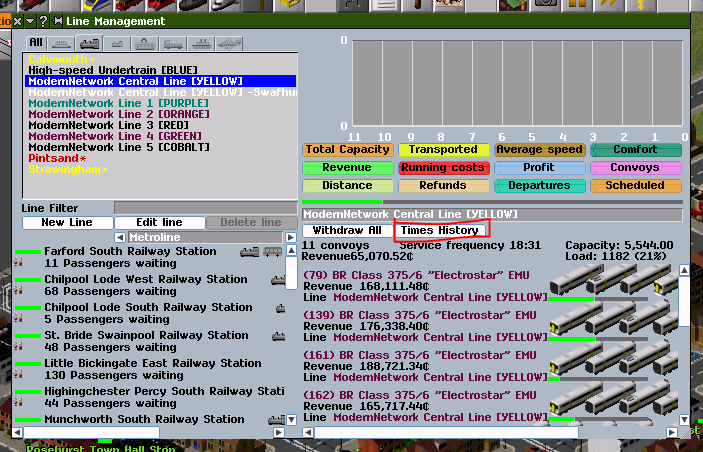

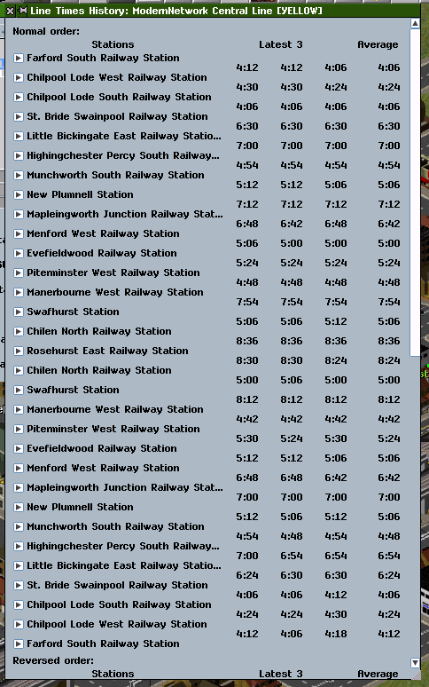

走行時間が出てきましたね。

さて、このデータをSimuDiaで読み込める形式にします。まず、テキストエディタで新しいファイルを作り、以下を入力します。

.. code-block::

  [General]
  month_length=62400
  shift_divisor=1440
  default_loading_time = 0005

  [Stations]

  [RawTimes]

  [Lines]

このように、入力ファイルは ``[～～]`` によってブロック分けされています。まず ``[General]`` に基本的な情報を入力しましょう。 ``month_length`` に1ヶ月の長さを入力します。今回は6時間24分なので ``62400`` とします。 ``shift_divisor`` はゲーム内のshift値の分割数です。コンフィグから参照できますが、pak128.Britain-exなら恐らく ``1440`` でしょう。最後に、デフォルトの乗降時間を設定します。これは省略可能で、指定しないと30秒になりますが、ver13に上げてから乗降時間がほぼゼロになった（恐らく執筆当時のバグ…）ので短くしています。

さて、次に ``[Stations]`` に路線の駅リストを入力します。

.. code-block::

  [Stations]
  Farford
  Chilpool Lode West
  Chilpool Lode South
  St. Bride Swainpool
  Little Bickingate
  Highingchester Percy
  Munchworth
  Plumnell
  Mapleingworth
  Menford
  Evefieldwood
  Piterminster
  Manerbourne
  Swafhurst
  Chilen
  Rosehurst

駅間の走行時間を ``[RawTimes]`` に入力します。矩形選択が出来るテキストエディタを使うと、 ``:`` 以前の入力が非常に楽なのでオススメです。こんな感じ。

.. code-block::

  [RawTimes]
  Farford              -> Chilpool Lode West   :0406
  Chilpool Lode West   -> Chilpool Lode South  :0424
  Chilpool Lode South  -> St. Bride Swainpool  :0406
  St. Bride Swainpool  -> Little Bickingate    :0630
  Little Bickingate    -> Highingchester Percy :0700
  Highingchester Percy -> Munchworth           :0454
  Munchworth           -> Plumnell             :0506
  Plumnell             -> Mapleingworth        :0712
  Mapleingworth        -> Menford              :0642
  Menford              -> Evefieldwood         :0500
  Evefieldwood         -> Piterminster         :0524
  Piterminster         -> Manerbourne          :0448
  Manerbourne          -> Swafhurst            :0754
  Swafhurst            -> Chilen               :0506
  Chilen               -> Rosehurst            :0836

  Rosehurst            -> Chilen               :0824
  Chilen               -> Swafhurst            :0500
  Swafhurst            -> Manerbourne          :0812
  Manerbourne          -> Piterminster         :0442
  Piterminster         -> Evefieldwood         :0524
  Evefieldwood         -> Menford              :0506
  Menford              -> Mapleingworth        :0642
  Mapleingworth        -> Plumnell             :0700
  Plumnell             -> Munchworth           :0506
  Munchworth           -> Highingchester Percy :0448
  Highingchester Percy -> Little Bickingate    :0654
  Little Bickingate    -> St. Bride Swainpool  :0624
  St. Bride Swainpool  -> Chilpool Lode South  :0406
  Chilpool Lode South  -> Chilpool Lode West   :0424
  Chilpool Lode West   -> Farford              :0412

最後に路線データを入力します。まずは元々ある各駅停車。

.. code-block::

  [Lines]
  name = Local
  divisor = 8
  <reverse> Farford
  Chilpool Lode West
  Chilpool Lode South
  St. Bride Swainpool
  Little Bickingate
  Highingchester Percy
  Munchworth
  Plumnell
  Mapleingworth
  Menford
  Evefieldwood
  Piterminster
  Manerbourne
  Swafhurst
  Chilen
  <reverse> Rosehurst
  Chilen
  Swafhurst
  Manerbourne
  Piterminster
  Evefieldwood
  Menford
  Mapleingworth
  Plumnell
  Munchworth
  Highingchester Percy
  Little Bickingate
  St. Bride Swainpool
  Chilpool Lode South
  Chilpool Lode West

まず基本データを入力します。``name`` は路線名。``divisor`` は1ヶ月間の発車回数です。それから停車駅を入力します。基本的に路線編集画面と同じ順番で入力すればOKです。折り返し時間が必要な駅は ``<reverse>`` を追加します。

これで準備は万端です。拡張子.simudiaで保存して、SimuDiaに読ませると、こんな感じのダイヤグラムが出力されます。

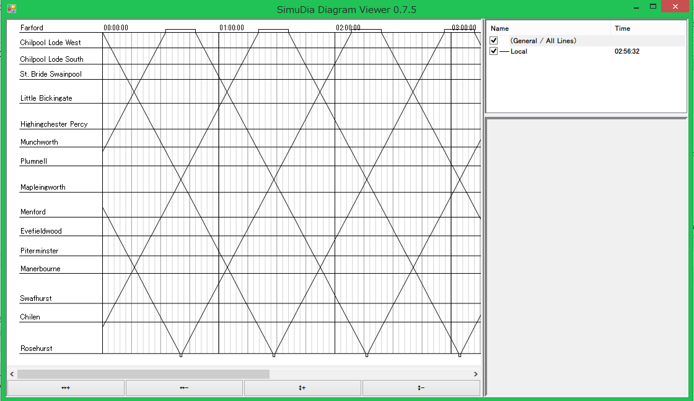

それっぽいですね。さて、次に快速のデータを入力することにしましょう。まだ快速の時間計測を行っていない気がしますが、とにかくファイルの続きに、以下のように入力します。

.. code-block::

  -----
  name = Rapid
  divisor = 8
  color = #008800
  width = 2
  <trip_offset=-0730, reverse> Farford
  <trip_offset=-1000> Little Bickingate
  <trip_offset=-0730> Menford
  <trip_offset=-0500> Swafhurst
  <trip_offset=-0500, reverse> Rosehurst
  <trip_offset=-0730> Swafhurst
  <trip_offset=-1000> Menford
  <trip_offset=-0730> Little Bickingate

``-----`` で分割することで新しい路線を入力できるようになります。気になるのはそれぞれの駅に ``trip_offset`` なるオプションが付いていることですが、これは次の駅との移動時間を増減させるものです。例えば ``[RawTimes]`` に ``Farford -> Little Bickingate`` なる行が無い場合、各駅停車の時間を単純に加算して移動時間を計算します。これでは、通過する駅への減速・停車・加速にかかる時間が入ってしまっているので、それを考慮して移動時間を短くしているのです。この例では、1駅飛ばすごとに2分30秒の時間短縮が見込めるとして計算しています（後に、これがやり過ぎであることが判明するのですが…）。

さて、これで入力ファイルを上書き保存すると、SimuDiaは自動的にファイルを再読み込みします。入力に間違いがなければ、このようになるはずです。

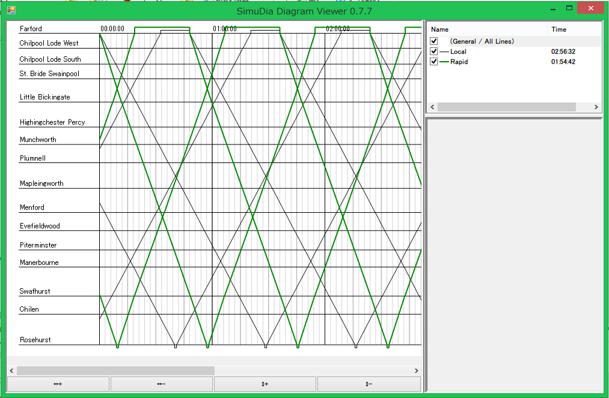

確かに快速の方が速くなっていますね。

これを使って色々な調整を加えていきます。まず、折り返し駅での停車時間が不釣り合いなので、Rosehurst駅での停車時間を伸ばしましょう。また、現在は快速と各停が同時に発車しているので、各停の発車時刻を遅らせましょう。以下のように書き換えます。

各駅停車 (Local):

.. code-block::

  …
  <shift=1000, reverse> Farford
  …
  <wait=3000, reverse> Rosehurst
  …

快速 (Rapid):

.. code-block::

  …
  <trip_offset=-0500, wait=1500, reverse> Rosehurst
  …

これで保存するとこうなります。

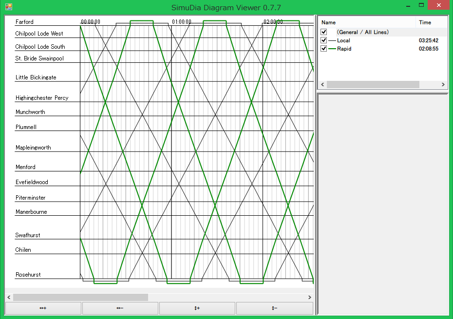

何だかそれっぽい。追い越しはどこにも無いけど…

この後、Swafhurst以南は利用者が少ないので、各停はこの駅で折り返しとし、快速のみがより奥の各駅に停まるようにします。また、せっかくなのでもう少し本数を増やしてみます。ということで、とりあえず完成した改正ダイヤはこう。

.. code-block::

  [Lines]
  name = Local
  divisor = 12
  <shift=0400, reverse> Farford
  Chilpool Lode West
  Chilpool Lode South
  St. Bride Swainpool
  Little Bickingate
  Highingchester Percy
  Munchworth
  Plumnell
  Mapleingworth
  Menford
  Evefieldwood
  Piterminster
  Manerbourne
  <wait=2000, reverse> Swafhurst
  Manerbourne
  Piterminster
  Evefieldwood
  Menford
  Mapleingworth
  Plumnell
  Munchworth
  Highingchester Percy
  Little Bickingate
  St. Bride Swainpool
  Chilpool Lode South
  Chilpool Lode West
  -----
  name = Rapid
  divisor = 12
  color = #008800
  width = 2
  <shift_num=1, trip_offset=-0730, reverse> Farford
  <trip_offset=-0500> Little Bickingate
  <trip_offset=-0230> Plumnell
  <trip_offset=-0730> Menford
  Swafhurst
  Chilen
  <wait=1500, reverse> Rosehurst
  Chilen
  <trip_offset=-0730> Swafhurst
  <trip_offset=-0230> Menford
  <trip_offset=-0500> Plumnell
  <trip_offset=-0730> Little Bickingate

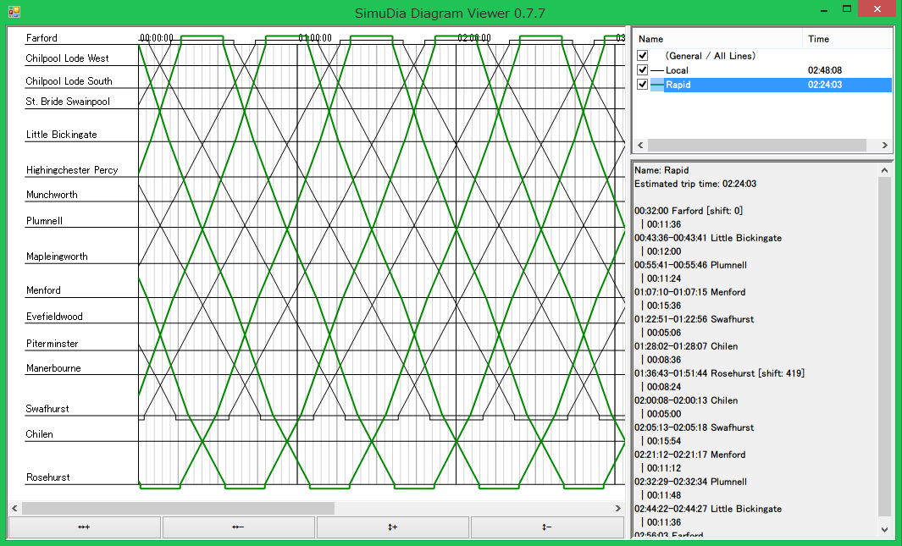

SimuDia内で、右上にある種別をクリックすると、画像のように右下の部分に詳細情報が出てきます。ここで ``[shift=～～]`` と出ている部分をゲーム内のshift値として入力すれば良いわけです（現在少し不具合がありますが、実用上問題ないのでこの記事では出てきた値をそのまま使うことにします）。さて、ここまでデータが出揃った時点で、ゲーム内で新たなダイヤで列車を走らせましょう。そして、運用がいい感じに安定してきた所で、快速の正しい所要時間を計測することにします。とある列車が1駅を除いていい感じに詰まらずに運転してくれたので、これの時間を使いましょう。車両情報ウィンドウに新しく追加されたボタンがあるので、これをクリックします。

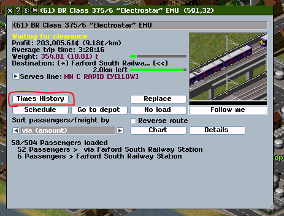

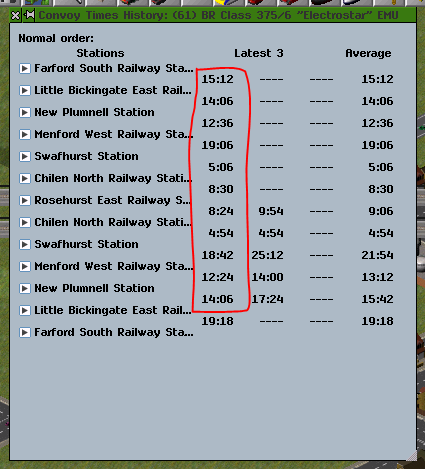

赤で囲った部分が上手いこと計測できた時間です。これを ``[RawTimes]`` に入力します。
惜しくも詰まらせて遅れが出てしまった復路の1区間は、往路の時間を使うことにしましょう。

.. code-block::

  Farford           -> Little Bickingate :1512
  Little Bickingate -> Plumnell          :1406
  Plumnell          -> Menford           :1236
  Menford           -> Swafhurst         :1906
  Swafhurst         -> Chilen            :0506
  Chilen            -> Rosehurst         :0830

  Rosehurst         -> Chilen            :0824
  Chilen            -> Swafhurst         :0454
  Swafhurst         -> Menford           :1842
  Menford           -> Plumnell          :1224
  Plumnell          -> Little Bickingate :1406
  Little Bickingate -> Farford           :1512

合わせて、``trip_offset`` を削除します。

.. code-block::

  <reverse> Farford
  Little Bickingate
  Plumnell
  Menford
  Swafhurst
  Chilen
  <wait=1500, reverse> Rosehurst
  Chilen
  Swafhurst
  Menford
  Plumnell
  Little Bickingate

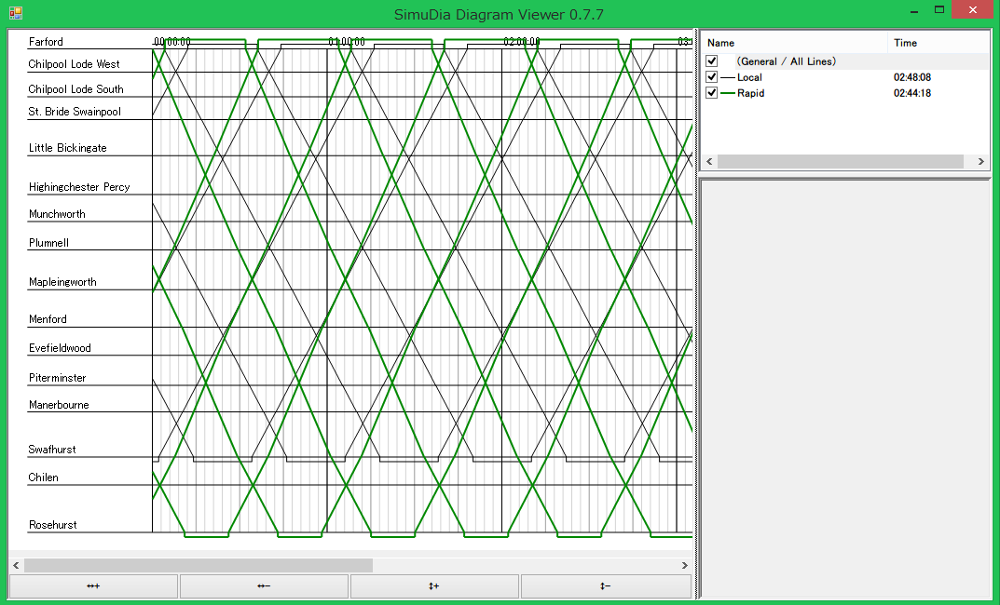

ちょっと崩れてしまいましたね。時間短縮の見込みが楽観的すぎたのが原因です。これを基にして更にダイヤを調節します。

最終的にはこのようになりました。

.. code-block::

  [Lines]
  name = Local
  divisor = 12
  <shift=1000, reverse> Farford
  Chilpool Lode West
  Chilpool Lode South
  St. Bride Swainpool
  Little Bickingate
  Highingchester Percy
  Munchworth
  Plumnell
  Mapleingworth
  Menford
  Evefieldwood
  Piterminster
  Manerbourne
  <wait=2000, reverse> Swafhurst
  Manerbourne
  Piterminster
  Evefieldwood
  Menford
  Mapleingworth
  Plumnell
  Munchworth
  Highingchester Percy
  Little Bickingate
  St. Bride Swainpool
  Chilpool Lode South
  Chilpool Lode West
  -----
  name = Rapid
  divisor = 12
  color = #008800
  width = 2
  <shift_num=1, reverse> Farford
  Little Bickingate
  Plumnell
  Menford
  Swafhurst
  Chilen
  <wait=0500, reverse> Rosehurst
  Chilen
  Swafhurst
  Menford
  Plumnell
  Little Bickingate

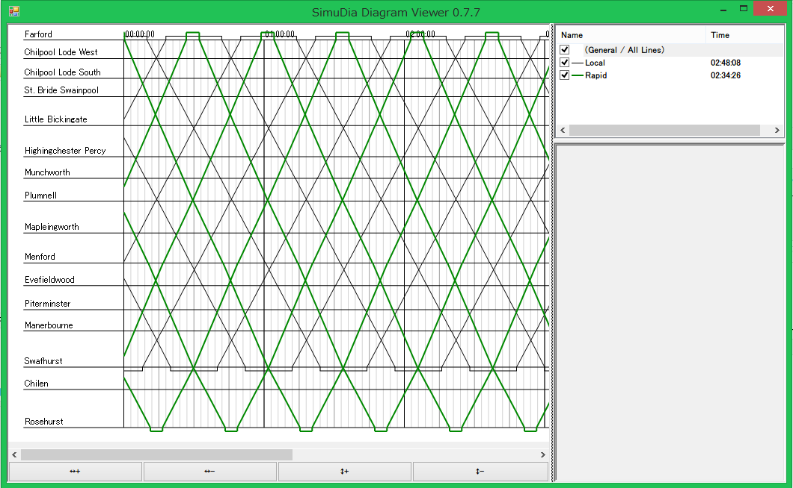

あれ？これもしかして快速にする意味ほとんどないんじゃ…

試してみたい！
-------

SimuDiaのダウンロードは `ここ <https://github.com/suitougreentea/SimuDia/releases>`_ から。Windows版バイナリが入手できます。最新版はこの記事の各過程の中間ファイル付き。

時間計測パッチは `line-time-measurementブランチ <https://github.com/suitougreentea/simutrans-extended/tree/line-time-measurement>`_ から。申し訳ありませんが現在バイナリは公開していないので、自前でコンパイル出来る人に限ります。

これからの予定
-------

SimuDia
  * まだまだバグがいっぱい
  * 選択されている路線の強調表示とか、ビューワー機能の強化
  * 情報画面の充実
  * 多言語化
  * 需要次第でGUIの編集環境を組み込む（需要があれば教えてください）
時間計測パッチ
  * 本体に組み込んでもらえるように機能を完成させる（翻訳データの用意とか、GUIの不具合修正とか…）
  * 現在はデータが6秒単位ですが、平均ぐらいは精度を上げてもいいかもしれない

と色々書きつつ、他の諸々に忙殺されてあまり時間が取れていない状況です…。Pull Requestとか投げていただけると嬉しくて飛び上がっちゃうかもしれません。機能要望もウェルカムです。

長々とした記事でしたが、最後まで読んで下さってありがとうございます。繰り返しになりますが、これからどうぞよろしくお願いします。
